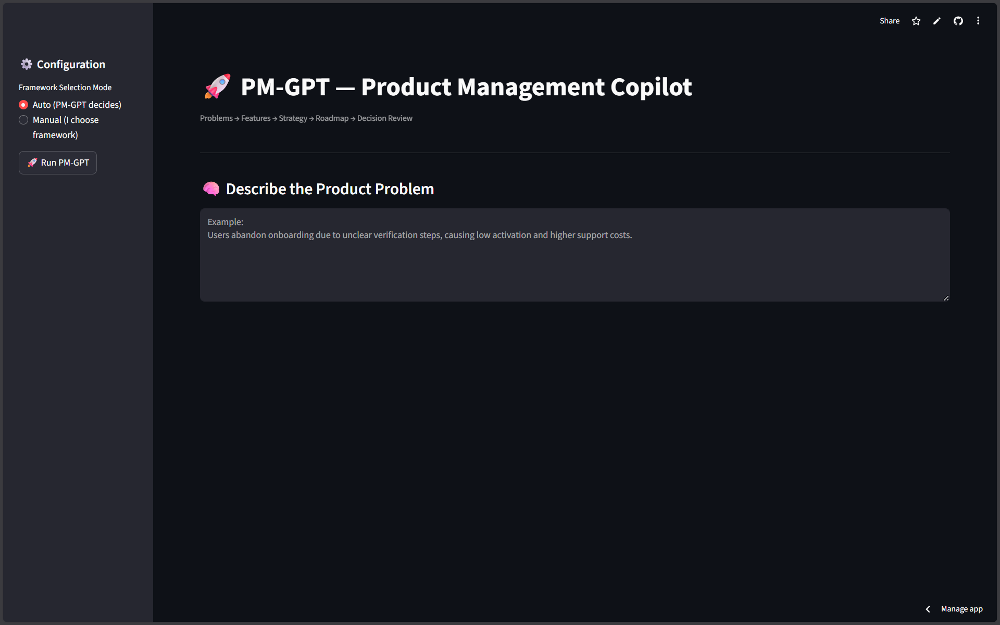
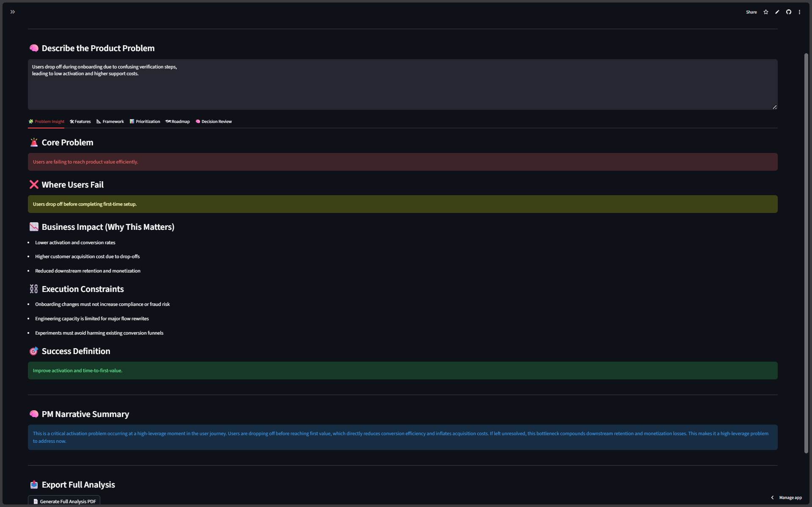
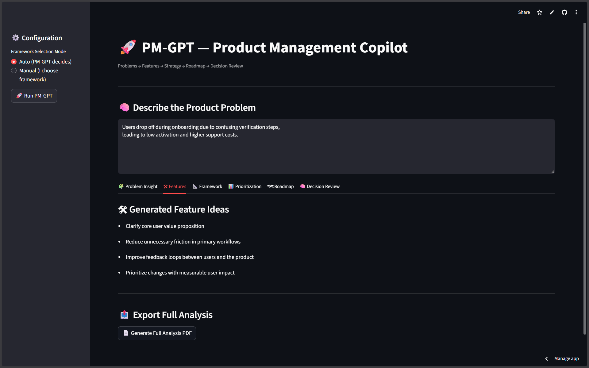
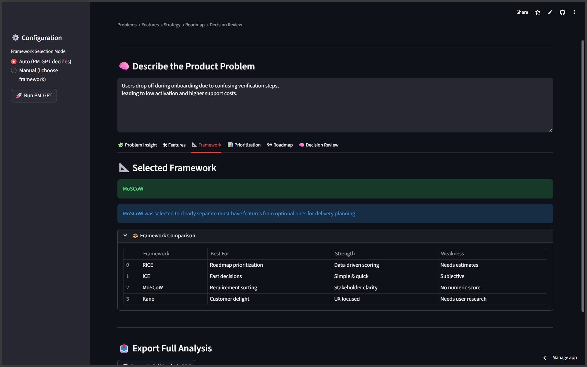
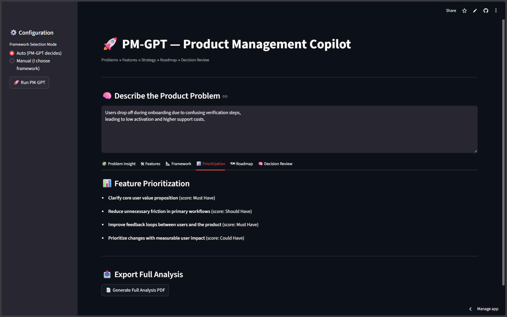
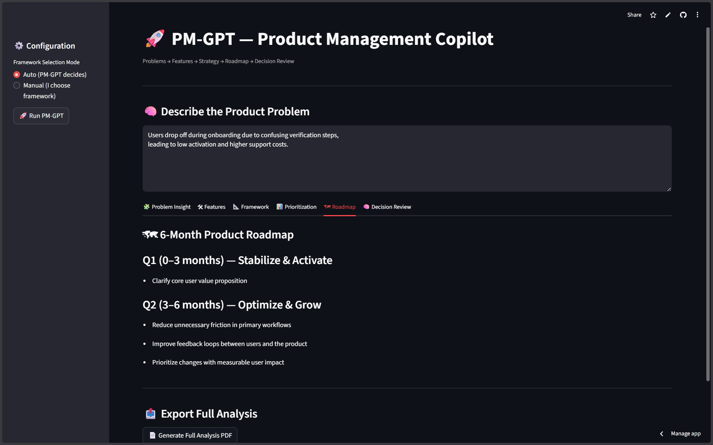
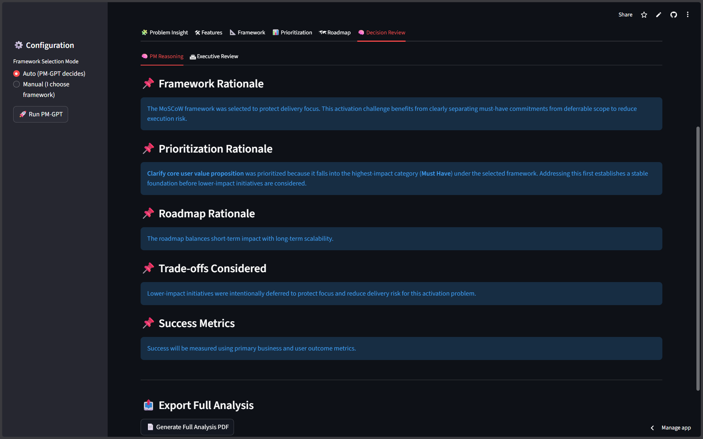

# 🚀 PM-GPT — AI-Powered Product Management Copilot

[](https://opensource.org/licenses/MIT)
[](https://streamlit.io/)
[](https://www.python.org/downloads/)

PM-GPT is an AI-powered **Product Management Copilot** that transforms ambiguous product challenges into **structured problem insights, prioritized decisions, and defensible product roadmaps**.

This project is intentionally designed to reflect **real-world product management thinking**, not surface-level automation. Each output mirrors how experienced Product Managers frame problems, evaluate trade-offs, and communicate decisions clearly to stakeholders and leadership.

> **Note:** PM-GPT was built as a **flagship portfolio project** to demonstrate **real-world PM decision-making**, not as a tutorial, demo toy, or generic AI application.

🔗 **Live Demo:** https://pm-gpt-copilot.streamlit.app

---

## 📘 Product Journal (PM-GPT Copilot)

Alongside the codebase, I maintain a public product journal documenting the **thinking, decisions, trade-offs, and reasoning** behind building PM-GPT.

This journal focuses on:
- Product thinking under ambiguity  
- Framework-driven prioritization decisions  
- Design trade-offs and scope boundaries  
- Intentional, long-term product development  

### 📝 Journal Entries

- **Journal Entry 1 — Building a Product That Teaches Product Thinking**  
  Explores ambiguity as the core challenge in Product Management and the vision behind PM-GPT Copilot.  
  🔗 https://medium.com/@urishita8888/pm-gpt-copilot-day-1-bf09b75486bb

- **Journal Entry 2 — Choosing the Right Framework Under Ambiguity**  
  Examines why framework selection is a product decision, how misapplied frameworks lead to poor outcomes, and how PM-GPT reasons intentionally under uncertainty.  
  🔗 https://medium.com/@urishita8888/choosing-the-right-framework-under-ambiguity-c758bc7c03dc

- **Journal Entry 3 — Product Decisions Are Trade-offs, Not Choices**  
  Explores how real product decisions are shaped by constraints, opportunity costs, and the discipline of saying no, emphasizing judgment over certainty in PM work.  
  🔗 https://medium.com/@urishita8888/product-decisions-are-trade-offs-not-choices-6e138ff89a1f


## 🖼️ Screenshots

A visual walkthrough of PM-GPT’s end-to-end decision reasoning flow:










---

## 🎥 Demo Video

A short walkthrough demonstrating PM-GPT in action is available in the repository:

📂 `demo/pm-gpt-demo.webm`

*(This may later be replaced with a hosted video link.)*

---

## ✨ Key Capabilities

### 🎯 Problem Analysis
- Identifies the core problem behind vague or noisy product signals  
- Surfaces where user value and business outcomes are at risk  
- Frames problems using impact, urgency, and real-world constraints  

### 🛠 Feature Ideation
- Generates realistic, high-leverage solution ideas  
- Aligns features with problem archetypes and business context  
- Avoids speculative or impractical product thinking  

### ⚖️ Smart Prioritization
- Automatically selects the most appropriate framework (RICE, ICE, Kano, MoSCoW)  
- Clearly explains *why* a framework fits the situation  
- Enables side-by-side comparison of prioritization outcomes  

### 📊 Decision Intelligence
- Simulates executive and stakeholder pushback  
- Documents trade-offs, risks, and consciously rejected alternatives  
- Produces PM-grade narratives suitable for reviews and interviews  

### 📅 Roadmap Generation
- Builds a realistic 6-month product roadmap  
- Balances strategy, execution, and resource constraints  
- Exports a professional PDF with full decision reasoning  

---

## 🚀 Getting Started

### Prerequisites
- Python 3.9+ (tested on Python 3.11)
- pip

### Installation & Run

```bash
git clone https://github.com/nagarishitaupputuri2007/pm-gpt.git
cd pm-gpt
pip install -r requirements.txt
streamlit run ui/app.py
```

---

## 🏗 Project Structure

```
pm-gpt/
├── product/          # Core PM reasoning and decision logic
├── roadmap/          # Roadmap generation & PDF export
├── ui/               # Streamlit user interface
├── tests/            # Test suites
├── assets/           # Screenshots and demo media
├── demo/             # Product demo recordings
└── README.md
```

---

## 🎯 Who This Project Is For

- Aspiring Product Managers (APM / PM / Intern roles)  
- PM interview preparation and case discussion practice  
- Recruiters evaluating real-world product decision-making ability  
- Anyone interested in structured, explainable PM thinking  

This project prioritizes **clarity, explainability, and reasoning quality** — the same standards expected in real-world PM teams and BigTech product organizations.

---

## 👩‍💻 Author

**Upputuri Naga Rishita**  
B.Tech CSE (AI & Future Technologies)  
SRM University AP  

---

## 📄 License

This project is licensed under the **MIT License**.
